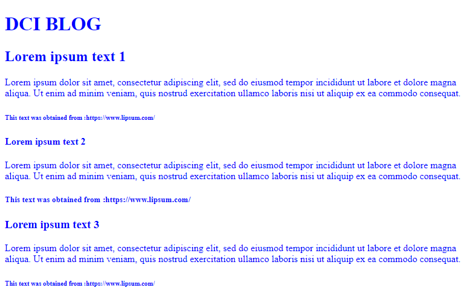
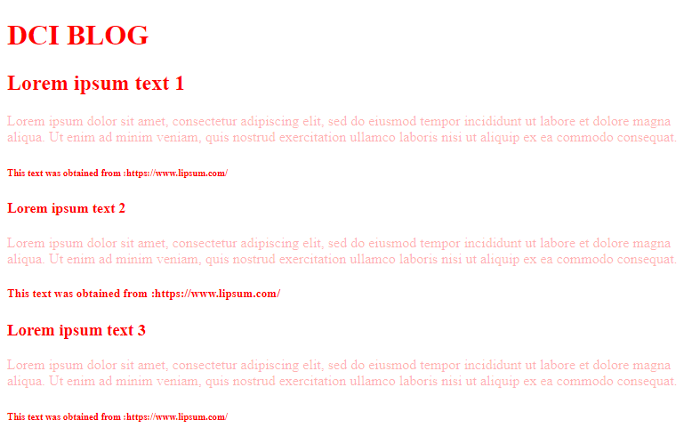
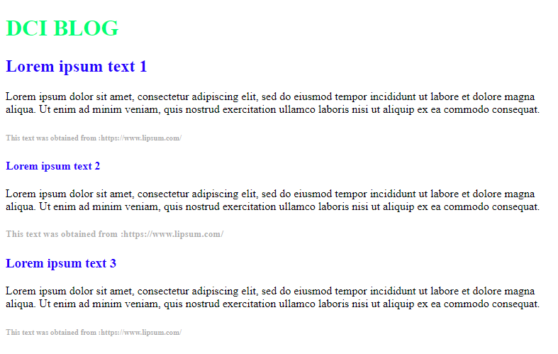

# Font color in your HTML page
## Write different css rules for changing the color of the text. 

* Given the html page, create three sets of rules for changing the color of the text. Each set should make the text look like the following images:
* Set 1
 
* Set 2
 
* Set 3
 

For using each set, comment the others with "/* */". These are the colors used in the sets, you can check which color is by going to : http://hslpicker.com/  and enter the values.
* rgb(0, 0, 255)
* rgba(255,10,10,1)
* rgb(255, 10, 10,0.3)
* hsl(0, 0%, 0%)
* hsl(144, 100%, 50%)
* hsl(251, 100%, 50%)
* hsl(10, 0%, 35%, 0.5)

**See the images for reference**